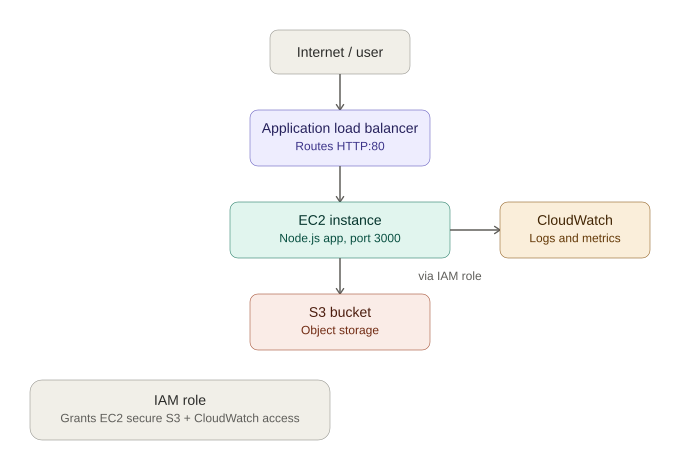

# Node.js App Deployment on AWS (EC2 + S3 + ALB)

A hands-on DevOps project demonstrating deployment of a Node.js application on AWS using core cloud infrastructure services — EC2, S3, IAM, Application Load Balancer, and CloudWatch.

## 🏗️ Architecture



```
                        ┌───────────────────┐
   Internet  ────────►  │  Application Load  │
                        │   Balancer (ALB)    │
                        └─────────┬──────────┘
                                  │
                        ┌─────────▼──────────┐
                        │   EC2 Instance      │
                        │  (Node.js + PM2)    │
                        │  IAM Role Attached  │
                        └─────────┬──────────┘
                                  │
                        ┌─────────▼──────────┐
                        │     S3 Bucket       │
                        │  (Object Storage)   │
                        └────────────────────┘

                        CloudWatch (Logs & Monitoring)
```

## 🚀 Tech Stack

- **Compute:** AWS EC2 (Amazon Linux 2023, t2.micro)
- **Application:** Node.js + Express
- **Storage:** AWS S3
- **Load Balancing:** AWS Application Load Balancer (ALB)
- **Security:** AWS IAM Roles (least-privilege access, no hardcoded credentials)
- **Monitoring:** AWS CloudWatch (logs & metrics)
- **Process Management:** PM2 (keeps the app running persistently)

## 📋 What This Project Demonstrates

- Launching and configuring an EC2 instance with a custom Security Group
- Attaching an IAM Role to EC2 for secure, credential-free access to S3
- Building a Node.js/Express app that reads from an S3 bucket via the AWS SDK
- Running the app persistently in the background using PM2
- Setting up a Target Group and Application Load Balancer to route traffic
- Configuring CloudWatch for centralized logging and monitoring
- Practicing cost control — tearing down non-free-tier resources (ALB) after testing

## 🔧 Setup Steps

1. **IAM Role** — Created an IAM Role (`EC2-S3-CloudWatch-Role`) with `AmazonS3FullAccess` and `CloudWatchAgentServerPolicy`, attached to the EC2 instance.
2. **EC2 Instance** — Launched a `t2.micro` Amazon Linux instance with a custom Security Group (ports 22, 80, 3000), using a User Data script to install Node.js and Git on boot.
3. **S3 Bucket** — Created an S3 bucket and connected it to the app via the AWS SDK (using the attached IAM Role — no access keys stored in code).
4. **Application Deployment** — Cloned the app from GitHub onto the EC2 instance, installed dependencies, and ran it persistently using PM2.
5. **Load Balancer** — Created a Target Group (port 3000) and an Application Load Balancer to route public HTTP traffic to the EC2 instance.
6. **CloudWatch** — Installed and configured the CloudWatch Agent on EC2 to stream logs for monitoring.

## 📝 Note on Infrastructure Lifecycle

All AWS resources for this project (EC2, ALB, Target Group) were provisioned, tested end-to-end, and then **deliberately torn down** after verification to avoid unnecessary cloud costs — a deliberate cost-management practice rather than an oversight. The full setup (including the EC2 instance, S3 bucket, IAM role, ALB, and CloudWatch agent) can be reproduced by following the setup steps above.

The application code (`app.js`) and this documentation reflect the exact working configuration that was deployed and verified, including:
- A successful `GET /` response confirming the app was reachable via both the EC2 public IP and the ALB DNS name
- A successful `GET /list-files` response confirming S3 access via the attached IAM role (no hardcoded credentials)

## 💰 Cost Management

- Used AWS Free Tier eligible resources (`t2.micro`, minimal S3 storage) wherever possible.
- The Application Load Balancer (not covered by the standard Free Tier) was created, tested, and **deleted immediately after verification** to avoid ongoing charges.
- Verified via AWS Cost Explorer and Billing Dashboard throughout the project.

## 🧠 Key Learnings

- How IAM Roles eliminate the need for hardcoded AWS credentials in application code
- How Security Groups control inbound/outbound traffic at the instance level
- How an ALB + Target Group work together to distribute traffic and perform health checks
- The importance of tearing down non-free-tier resources promptly to control cloud costs
- Using PM2 to keep a Node.js process alive across SSH sessions and reboots

## 🔜 Next Steps

- [ ] Add a GitHub Actions CI/CD pipeline to automate testing and deployment
- [ ] Migrate from AWS SDK v2 to v3
- [ ] Provision this same infrastructure using Terraform (Infrastructure as Code)

---

**Author:** Arslan
**Project Type:** Personal DevOps learning project
